# CRUD project
It's a basic CRUD project of employees and establishments
#### Technologies:
- Angular 11;
- Spring Boot;
- PostgreSQL.

# CRUD de Profissionais
### Listagem de Profissionais
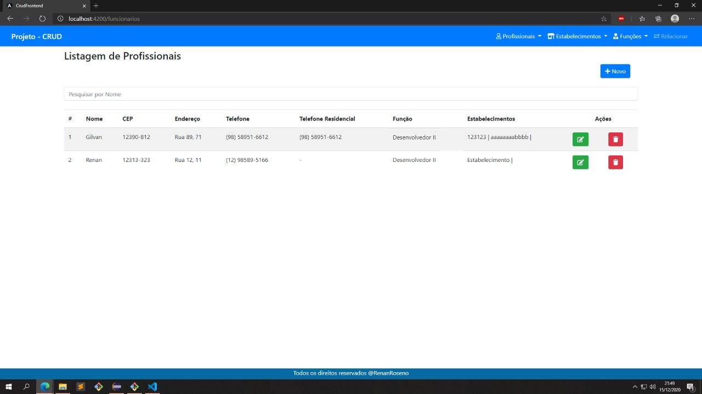

### Cadastro de Profissionais
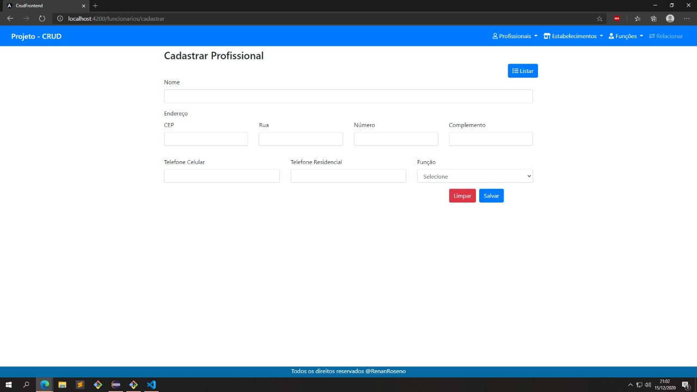

### Edição de Profissionais
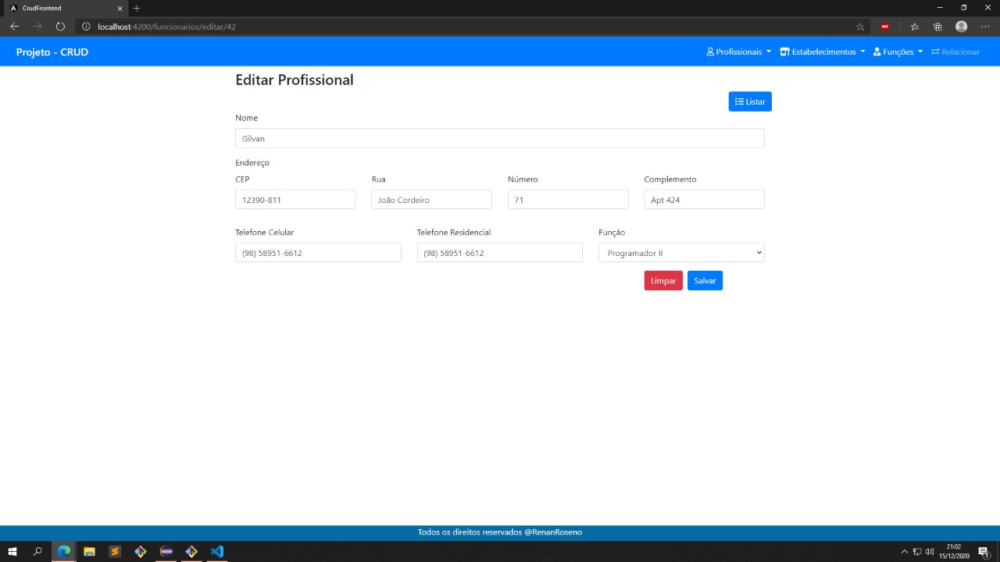

### Pesquisa de Profissionais
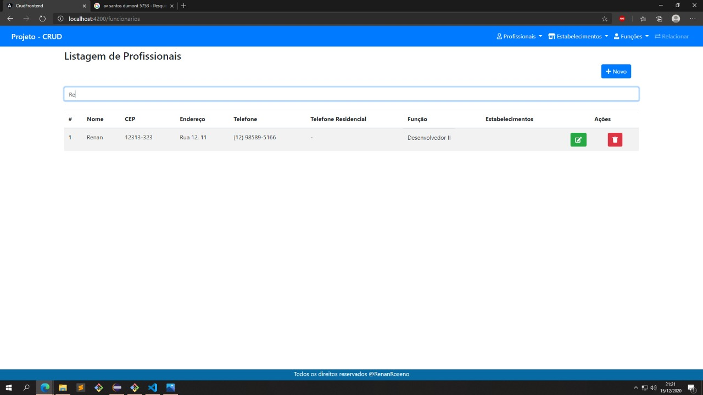

### Mensagem de erro (Em cadastrar, editar e excluir profissionais)
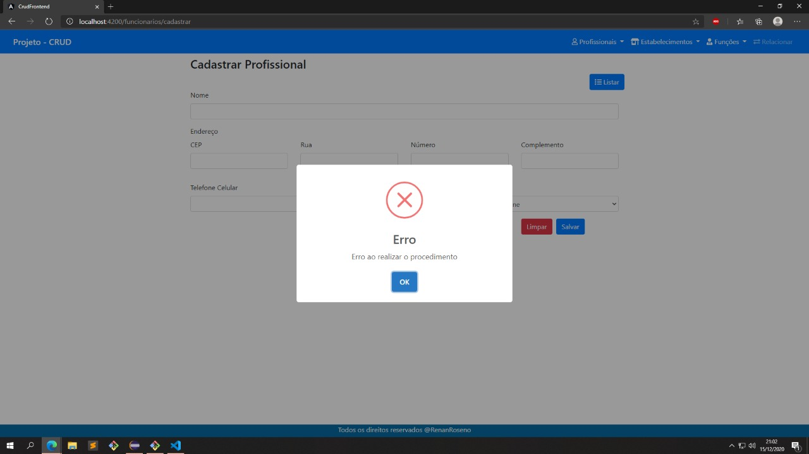

### Mensagem de sucesso (Em cadastrar, editar e excluir profissionais)
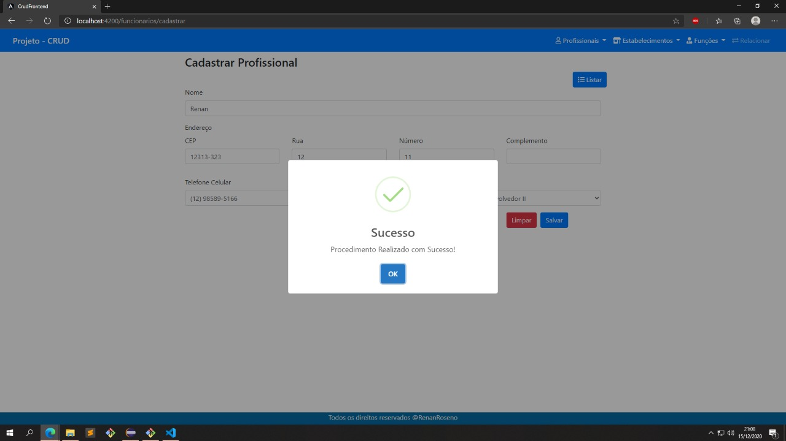

### Confirmação para excluir
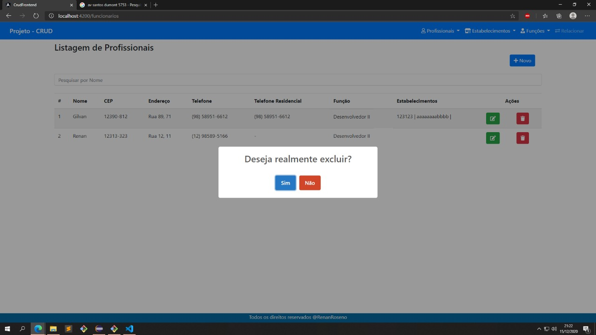

# CRUD de Estabelecimentos
### Listagem de Estabelecimentos
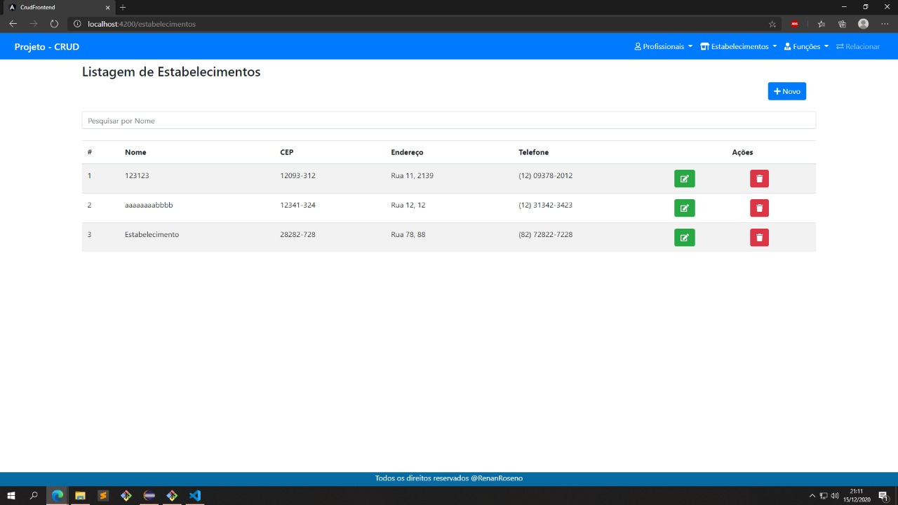

### Cadastro de Estabelecimentos
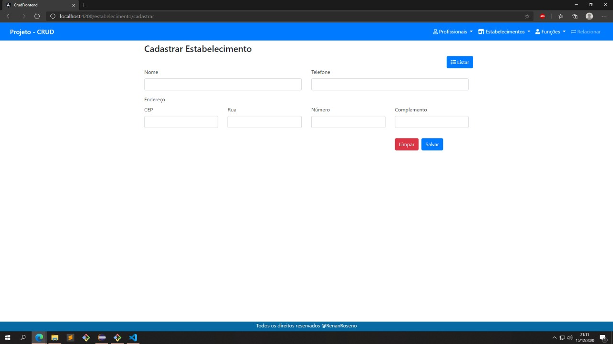

### Edição de Estabelecimentos
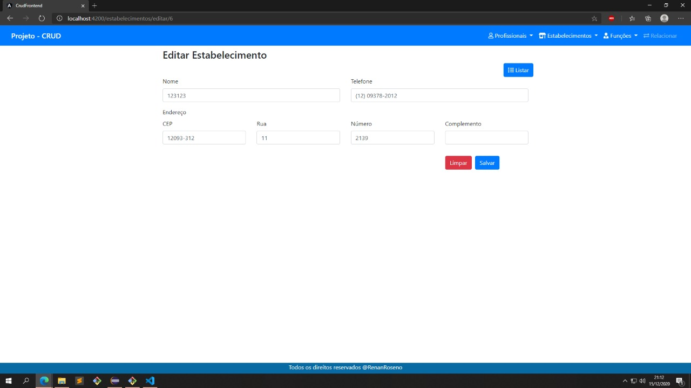

### Pesquisa de Estabelecimentos
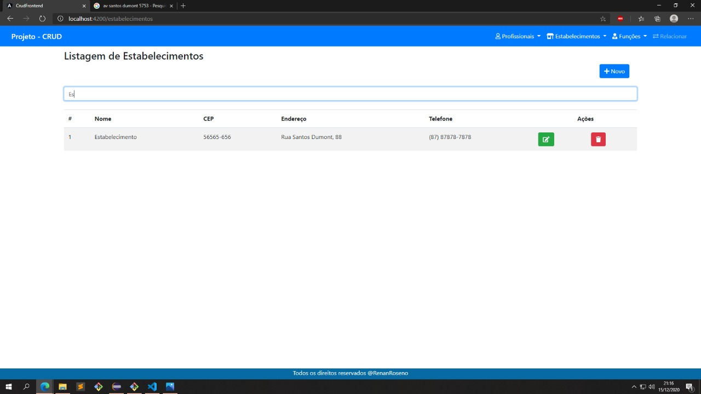

### Mensagem de erro (Em cadastrar, editar e excluir Estabelecimentos)
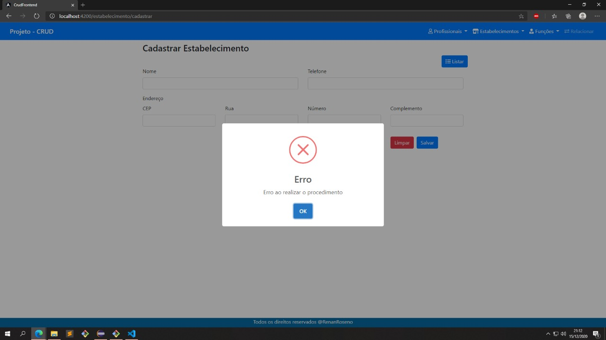

### Mensagem de sucesso (Em cadastrar, editar e excluir Estabelecimentos)
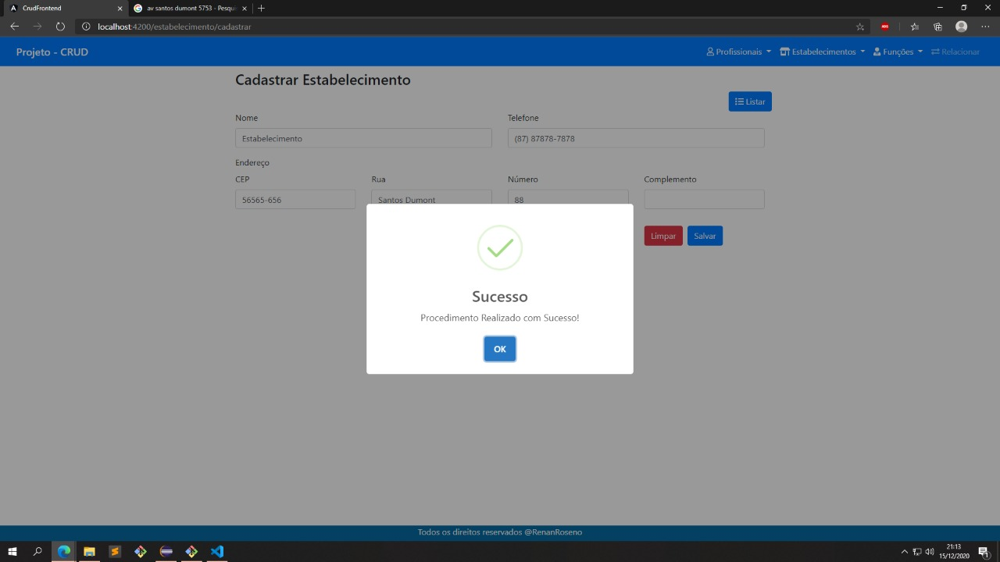

### Confirmação para excluir
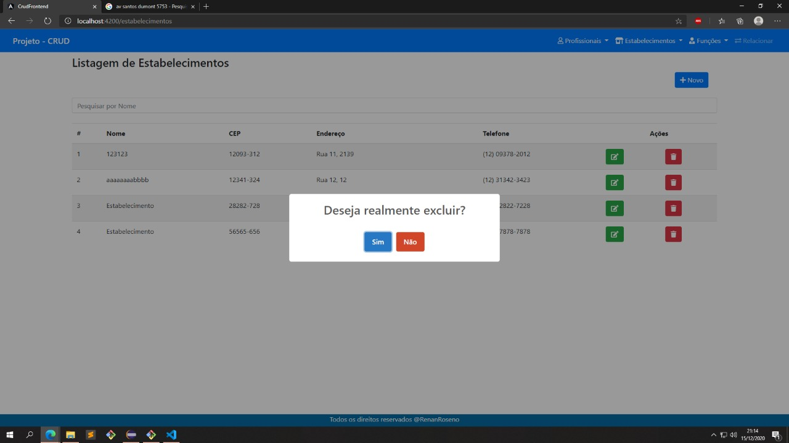

# CRUD de Profissionais
### Listagem de Profissionais

### Cadastro de Profissionais

### Edição de Profissionais

### Pesquisa de Profissionais

### Mensagem de erro (Em cadastrar, editar e excluir profissionais)

### Mensagem de sucesso (Em cadastrar, editar e excluir profissionais)

### Confirmação para excluir

# CRUD de Funções
### Listagem de Funções

### Cadastro de Funções

### Edição de Funções

### Pesquisa de Funções

### Mensagem de erro (Em cadastrar, editar e excluir Funções)

### Mensagem de sucesso (Em cadastrar, editar e excluir Funções)

### Confirmação para excluir

# Cadastro de Relações
### Cadastro de Relações
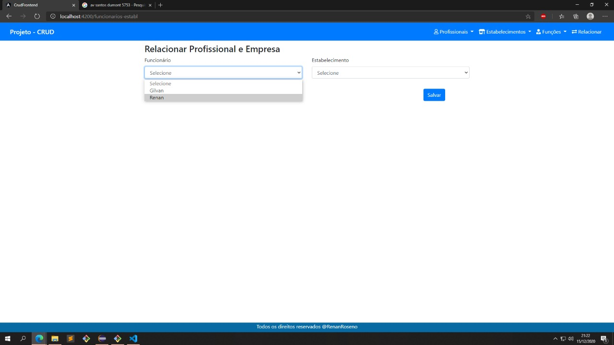
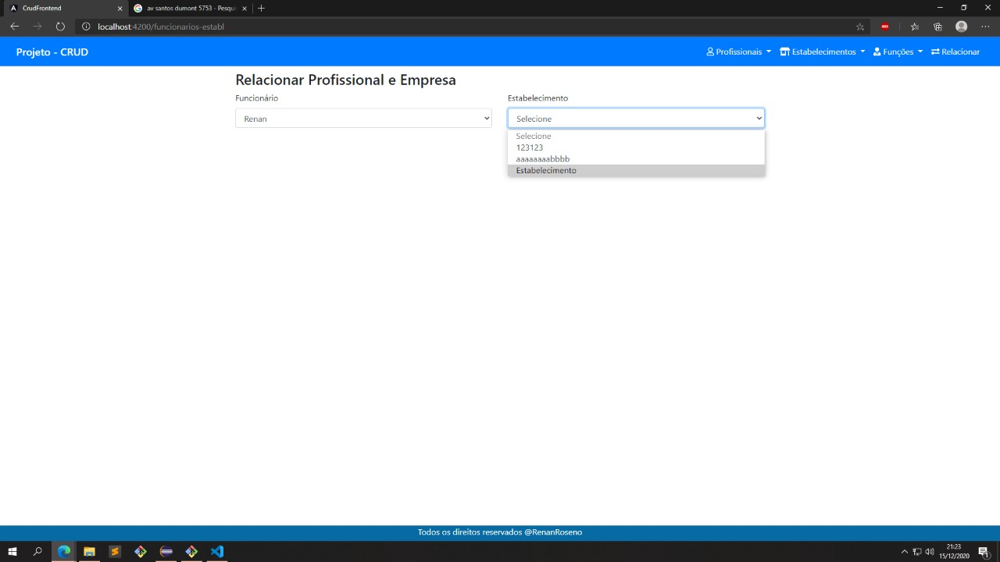

### Listagem de Relações
Note que na coluna de Estabelecimento mostrará os estabelecimentos que estão relacionados aos funcionários
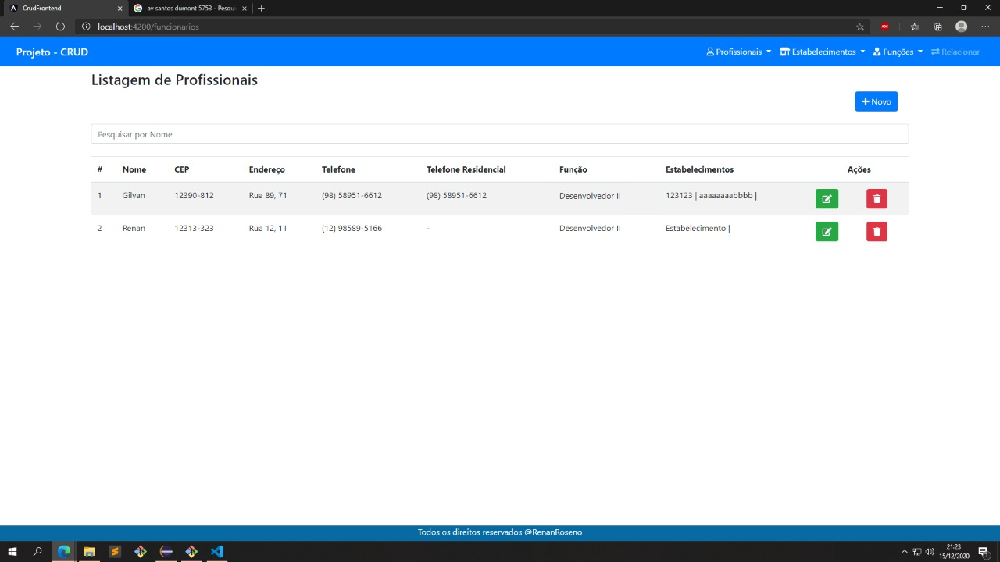

### Mensagem de erro (Em cadastrar, editar e excluir Funções)

### Mensagem de sucesso (Em cadastrar, editar e excluir Funções)
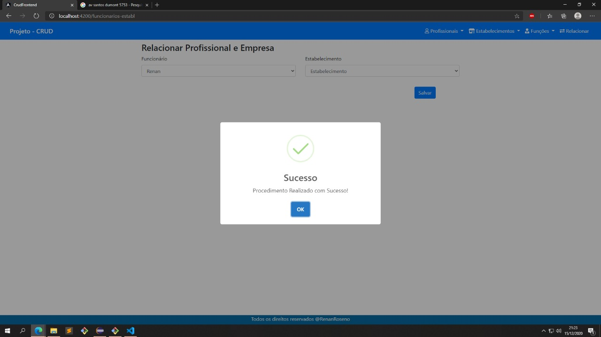

